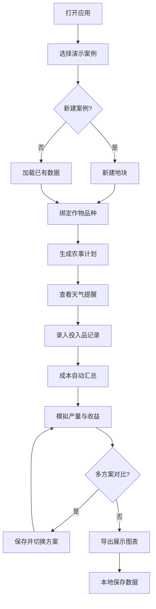

## 1. 产品概述

智慧农业演示系统是一款面向种植合作社的纯前端Web应用，专为展会展示和离线培训场景设计。通过直观的可视化界面，讲解人员可快速切换不同农业案例，完整演示从地块规划到收益测算的全流程农田管理。

- 核心用途：展会演示、培训教学、方案对比、决策辅助
- 目标用户：农业合作社讲解员、农技推广人员、农场管理者
- 产品价值：将复杂的农业生产管理流程标准化、可视化，提升展示效果和培训效率

## 2. 核心特性

### 2.1 用户角色

| 角色 | 注册方式 | 核心权限 |
|------|----------|----------|
| 讲解员/用户 | 无需注册，直接使用 | 全部功能：增删改查、数据切换、图表导出 |

### 2.2 功能模块

1. **地块看板**：地块总览、新增/编辑地块、种植面积标注、地块分布可视化
2. **作物档案**：作物品种库、品种选择、生长周期配置、产量参数
3. **农事日历**：播种-采收全周期计划生成、农事任务提醒、天气样例展示
4. **投入品记录**：施肥记录、灌溉记录、打药记录、人工与物料成本统计
5. **收益测算**：产量模拟、成本汇总、收益分析、多方案对比、图表导出

### 2.3 页面详情

| 页面名称 | 模块名称 | 功能描述 |
|-----------|-------------|---------------------|
| 地块看板 | 统计概览卡片 | 展示地块总数、总面积、种植作物种类、当前状态统计 |
| 地块看板 | 地块可视化网格 | 以彩色方块/卡片展示各地块，显示面积、作物、状态 |
| 地块看板 | 新增/编辑地块弹窗 | 表单输入地块名称、面积、位置、土壤类型、备注 |
| 作物档案 | 作物品种列表 | 展示预设作物（水稻、小麦、玉米、蔬菜等）及品种详情 |
| 作物档案 | 品种参数配置 | 设置亩产量、生长周期、单价、播种/采收时间窗口 |
| 作物档案 | 地块-作物绑定 | 为各地块分配种植作物品种 |
| 农事日历 | 月/周视图日历 | 展示各地块的农事任务时间轴 |
| 农事日历 | 计划生成器 | 根据作物品种和播种日期自动生成全周期农事计划 |
| 农事日历 | 天气样例面板 | 展示模拟的温度、降雨、预警信息卡片 |
| 投入品记录 | 分类记录列表 | 施肥/灌溉/打药三类记录，支持筛选和时间排序 |
| 投入品记录 | 新增记录表单 | 录入日期、地块、投入品名称、用量、单价、人工成本 |
| 投入品记录 | 成本统计面板 | 按分类、按地块、按时间维度统计成本饼图/柱状图 |
| 收益测算 | 产量模拟器 | 根据面积、品种、历史数据模拟预估产量 |
| 收益测算 | 成本收益明细表 | 分类展示各项成本、收入、利润计算 |
| 收益测算 | 多方案对比 | 支持保存多种种植方案，横向对比指标差异 |
| 收益测算 | 图表导出 | 支持导出PNG格式图表，保存/加载演示数据包 |

## 3. 核心流程

主要用户操作流程：讲解员打开应用 → 选择演示案例（或新建）→ 在地块看板创建/编辑地块 → 为地块绑定作物品种 → 查看自动生成的农事日历和天气样例 → 录入投入品记录（施肥、灌溉、打药）→ 在收益测算中查看自动计算的成本与收益 → 切换不同方案进行对比 → 导出图表用于展示。

## 4. 用户界面设计

### 4.1 设计风格

- **主色**：麦田绿 `#2D6A4F`（代表农业、自然、生长）
- **辅色**：丰收金 `#D4A72C`（代表收获、温暖、阳光）
- **中性色**：土壤棕渐变至纸白，营造大地质感
- **点缀色**：番茄红 `#E76F51`（警示）、天空蓝 `#457B9D`（灌溉/天气）
- **按钮风格**：圆角8px，轻微悬浮阴影，绿-金渐变主按钮
- **字体**：标题用「思源宋体」（稳重专业），正文用「思源黑体」（清晰易读）
- **布局风格**：左侧导航栏 + 顶部工具栏 + 主内容卡片布局
- **图标风格**：Lucide线性图标，配合农业主题emoji增添亲和力
- **视觉特色**：农田纹理背景、轻微噪点、卡片纸张质感、生长动画过渡

### 4.2 页面设计概览

| 页面名称 | 模块名称 | UI元素 |
|-----------|-------------|-------------|
| 地块看板 | 统计卡片 | 4张数据卡片并排，渐变背景，大数字+趋势箭头，悬停微上浮 |
| 地块看板 | 地块网格 | 响应式CSS Grid，彩色色块表示不同作物，hover显示详情tooltip |
| 地块看板 | 新增弹窗 | 居中模态框，半透明遮罩，分区表单，平滑缩放动画 |
| 作物档案 | 品种列表 | 水平Tab切换作物大类，卡片网格展示品种，绿色标签标状态 |
| 作物档案 | 参数配置 | 左右分栏，左侧列表，右侧详情表单，数字输入框带步进器 |
| 农事日历 | 日历视图 | 月历网格布局，任务色块覆盖日期，左侧图例说明颜色含义 |
| 农事日历 | 天气面板 | 4张天气卡片（今日/未来3天），带温度曲线条、降雨图标 |
| 投入品记录 | 记录表格 | 斑马纹表格，顶部筛选栏，右侧浮动操作按钮 |
| 投入品记录 | 统计图表 | 环形饼图+柱状图并排，Chart.js渲染，悬停显示数值 |
| 收益测算 | 数据看板 | 关键指标KPI卡片（产量、成本、收入、利润），大字号突出 |
| 收益测算 | 方案对比 | 多列横向对照表，差异值着色（绿色优/红色劣） |
| 收益测算 | 导出区域 | 图表预览区+导出按钮组，支持一键下载PNG |

### 4.3 响应式

- 桌面优先设计（1280px+），适配培训演示大屏
- 平板端（768px-1280px）：导航栏折叠为抽屉，网格自适应列数
- 移动端（<768px）：卡片单列堆叠，底部Tab导航替代侧边栏
- 所有交互元素支持触摸操作，最小点击区域44×44px

### 4.4 交互与动画

- 页面切换：淡入 + 轻微上移动画（0.3s ease）
- 数据加载：骨架屏脉冲动画
- 卡片悬停：translateY(-2px) + 阴影加深
- 表单提交：按钮旋转加载图标
- 数值变化：数字滚动动画（从旧值滚动到新值）
- 图表渲染：柱形/线条从底部生长动画
