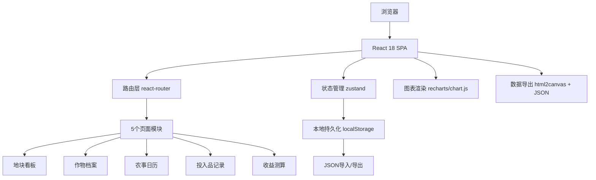
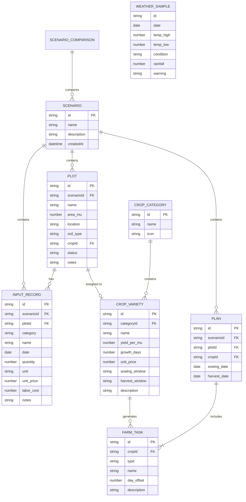

## 1. 架构设计

纯前端单页应用（SPA），无后端依赖。所有数据通过浏览器本地存储（localStorage）持久化，支持JSON导入导出。



## 2. 技术描述

- **前端框架**: React@18 + TypeScript + Vite@5
- **样式方案**: TailwindCSS@3 + 自定义CSS变量主题系统
- **路由管理**: react-router-dom@6
- **状态管理**: zustand@4（轻量，支持中间件持久化）
- **UI组件**: 自定义组件 + lucide-react图标
- **图表库**: recharts@2（React友好，支持导出）
- **图像导出**: html2canvas（DOM转PNG）
- **初始化工具**: vite-init（react-ts模板）
- **后端**: 无（纯前端）
- **数据库**: localStorage + JSON文件导入导出

## 3. 路由定义

| 路由 | 页面 | 用途 |
|-------|---------|---------|
| `/` | 地块看板 | 首页，展示地块总览与管理入口 |
| `/crops` | 作物档案 | 作物品种库管理与参数配置 |
| `/calendar` | 农事日历 | 农事计划时间轴与天气样例 |
| `/inputs` | 投入品记录 | 施肥/灌溉/打药记录与成本统计 |
| `/revenue` | 收益测算 | 产量模拟、成本分析、方案对比、导出 |

## 4. 数据模型

### 4.1 实体关系图



### 4.2 核心TypeScript类型定义

```typescript
// 演示方案
interface Scenario {
  id: string;
  name: string;
  description: string;
  createdAt: number;
}

// 地块
interface Plot {
  id: string;
  scenarioId: string;
  name: string;
  areaMu: number;
  location: string;
  soilType: '沙壤土' | '粘壤土' | '壤土' | '砂土' | '粘土';
  cropId: string | null;
  status: '空闲' | '备耕' | '种植中' | '生长中' | '待采收' | '已采收';
  notes: string;
}

// 作物大类
interface CropCategory {
  id: string;
  name: string;
  icon: string;
}

// 作物品种
interface CropVariety {
  id: string;
  categoryId: string;
  name: string;
  yieldPerMu: number;
  growthDays: number;
  unitPrice: number;
  sowingWindow: string;
  harvestWindow: string;
  description: string;
  tasks: FarmTaskTemplate[];
}

// 农事任务模板
interface FarmTaskTemplate {
  type: 'sowing' | 'fertilize' | 'irrigate' | 'pesticide' | 'weed' | 'harvest';
  name: string;
  dayOffset: number;
  description: string;
}

// 实际农事任务
interface ScheduledTask {
  id: string;
  plotId: string;
  cropId: string;
  type: string;
  name: string;
  date: string;
  completed: boolean;
  description: string;
}

// 投入品记录
type InputCategory = 'fertilizer' | 'irrigation' | 'pesticide';

interface InputRecord {
  id: string;
  scenarioId: string;
  plotId: string;
  category: InputCategory;
  name: string;
  date: string;
  quantity: number;
  unit: string;
  unitPrice: number;
  laborCost: number;
  notes: string;
}

// 天气样例
interface WeatherSample {
  date: string;
  tempHigh: number;
  tempLow: number;
  condition: '晴' | '多云' | '阴' | '小雨' | '中雨' | '大雨';
  rainfall: number;
  warning: string | null;
}

// 方案对比
interface ScenarioComparison {
  baseScenarioId: string;
  compareScenarioIds: string[];
}

// 测算结果
interface RevenueResult {
  totalArea: number;
  estimatedYield: number;
  totalRevenue: number;
  materialCost: number;
  laborCost: number;
  totalCost: number;
  netProfit: number;
  profitPerMu: number;
  roi: number;
}
```

### 4.3 预置演示数据

系统内置3套完整演示数据，支持一键切换：
1. **水稻种植示范**：南方稻田案例，5块地块，含完整农事计划和投入记录
2. **小麦-玉米轮作**：北方旱作案例，4块地块，展示轮作模式
3. **有机蔬菜种植**：设施农业案例，6块地块，高投入高产出对比

每套数据包含：地块信息、绑定的作物、已生成的农事计划、投入品记录样例、天气模拟数据。
